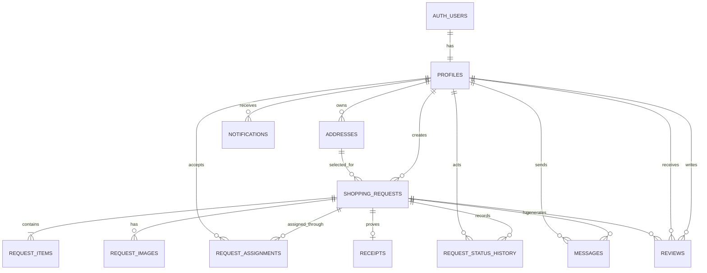

# Makko — Thiết kế database MVP

## 1. Quyết định thiết kế

- PostgreSQL/Supabase là nguồn dữ liệu chuẩn; client Expo chỉ gọi Data API/RPC được cấp quyền.
- Khóa chính dùng `uuid` để tương thích trực tiếp với `auth.users.id` và an toàn khi lộ ra client.
- Tiền dùng `numeric(12,2)` cùng mã tiền tệ ISO; không dùng `float`.
- Thời gian dùng `timestamptz`; tọa độ dùng `double precision` trong MVP.
- `shopping_requests` giữ snapshot địa chỉ giao để lịch sử đơn không đổi khi `addresses` được sửa.
- `request_assignments` tách khỏi yêu cầu để lưu vòng đời nhận đơn và mở đường cho lịch sử gán lại sau này; partial unique index đảm bảo chỉ một assignment đang hoạt động.
- Trạng thái hiện tại nằm trên `shopping_requests`; bảng `request_status_history` là audit log append-only.
- Xóa tài khoản không cascade xóa đơn/hóa đơn lịch sử. Hồ sơ dùng `on delete restrict`; quy trình xóa tài khoản cần ẩn danh hóa theo chính sách vận hành sau này.

## 2. ERD

## 3. Bảng và trách nhiệm

| Bảng | Trách nhiệm | Dữ liệu nhạy cảm |
|---|---|---|
| `profiles` | Hồ sơ công khai và trạng thái tài khoản | Điện thoại |
| `addresses` | Sổ địa chỉ riêng của người dùng | Địa chỉ, tọa độ |
| `shopping_requests` | Aggregate chính của yêu cầu | Snapshot địa chỉ, ngân sách |
| `request_items` | Mặt hàng cần mua | Ghi chú |
| `request_images` | Metadata đường dẫn Storage | Có thể chứa thông tin cá nhân |
| `request_assignments` | Shopper nhận yêu cầu | Quan hệ hai bên |
| `request_status_history` | Audit trạng thái append-only | Lý do hủy/tranh chấp |
| `messages` | Chat theo yêu cầu | Nội dung trao đổi |
| `receipts` | Hóa đơn và tổng thực tế | Ảnh hóa đơn |
| `reviews` | Đánh giá hai chiều | Nhận xét |
| `notifications` | Hộp thư thông báo trong app | Payload điều hướng |

## 4. Trạng thái và bất biến dữ liệu

### `shopping_requests.status`

`draft`, `open`, `accepted`, `shopping`, `delivering`, `completed`, `cancelled`, `disputed`.

Các bất biến quan trọng:

- Chỉ request `open` mới có thể được nhận.
- Một request có tối đa một `request_assignments` với `released_at is null`.
- Shopper không được là customer của chính request.
- Request `open` phải có ít nhất một item (kiểm tra trong RPC publish, vì CHECK không kiểm tra được bảng con).
- `actual_items_total` chỉ được ghi khi có hóa đơn; số tiền không âm.
- Review chỉ dành cho request `completed`, người viết/nhận phải là hai thành viên khác nhau của request.
- `request_status_history` và `messages` không cho phép update/delete từ client.

## 5. RLS/access matrix

| Resource | Public/authenticated đọc | Chủ sở hữu | Shopper đang nhận | Ghi chú |
|---|---|---|---|---|
| Hồ sơ | Trường hồ sơ công khai | Sửa hồ sơ mình | Đọc hồ sơ công khai | Không công khai điện thoại qua table trực tiếp |
| Địa chỉ | Không | CRUD địa chỉ mình | Đọc snapshot trên request đã nhận | Không đọc bảng address của người khác |
| Request `open` | Authenticated đọc dữ liệu khám phá | Sửa nháp/open theo rule | Nhận qua RPC | Địa chỉ đầy đủ không nên trả ở feed |
| Request riêng | Không | Đọc | Đọc khi active assignment | Dùng view/RPC DTO ở bước API để tách dữ liệu công khai/riêng |
| Items/images | Đọc nếu xem được request | CRUD trước khi nhận | Đọc | Storage policy riêng cho object |
| Assignment | Không | Đọc assignment request mình | Đọc assignment mình | Tạo qua RPC `accept_request` |
| History | Thành viên request | Đọc | Đọc | Chèn bởi trigger/RPC |
| Messages | Không | Đọc/gửi | Đọc/gửi | Chỉ hai thành viên |
| Receipt | Không | Đọc | Tạo/cập nhật trước delivery | Một receipt/request |
| Reviews | Authenticated đọc | Tạo review hợp lệ | Tạo review hợp lệ | Không sửa điểm sau khi gửi trong MVP |
| Notifications | Không | Chỉ người nhận đọc/cập nhật `read_at` | — | Chèn bởi backend |

Lưu ý: bảng `shopping_requests` chứa snapshot địa chỉ nên feed khám phá không nên `select *` trực tiếp. Giai đoạn API cần tạo `security_invoker` view hoặc RPC chỉ trả khu vực gần đúng cho người chưa tham gia.

## 6. Transaction nhận đơn

RPC `accept_request(request_id)` cần thực hiện trong một database transaction ngắn:

1. Xác thực `auth.uid()` tồn tại.
2. Cập nhật request bằng điều kiện `status = 'open' and customer_id <> auth.uid()`.
3. Nếu không có dòng được cập nhật, trả lỗi `request_not_available`.
4. Tạo active assignment cho shopper.
5. Trigger ghi lịch sử `open -> accepted`.
6. Commit; sau commit mới gửi push notification.

Điều kiện UPDATE và partial unique index cùng bảo vệ trường hợp nhận đồng thời. Không gọi API bản đồ, thanh toán hay push notification trong transaction giữ lock.

## 7. Index theo access pattern

- Feed: partial composite index trên `(created_at desc)` cho `status = 'open'`; khi thêm PostGIS sẽ thay bằng GiST location + điều kiện open.
- Dashboard customer: `(customer_id, created_at desc)`.
- Assignment đang hoạt động: unique partial `(request_id) where released_at is null` và `(shopper_id, accepted_at desc)`.
- Chat: `(request_id, created_at, id)` hỗ trợ keyset pagination.
- Notification chưa đọc: partial `(recipient_id, created_at desc) where read_at is null`.
- Mọi foreign key thường xuyên join/cascade đều có index.
- Các cột sở hữu dùng trong RLS (`customer_id`, `owner_id`, `shopper_id`, `recipient_id`, `sender_id`) đều được index.

## 8. Bước tiếp theo

1. Chốt chính sách hủy sau khi shopper đã mua hàng.
2. Chốt mô hình tiền: tiền mặt/chuyển khoản hay escrow; sau đó mới thêm `payments`/`ledger_entries`.
3. Tạo project Supabase và Supabase CLI, sinh migration bằng `supabase migration new init_makko_mvp`.
4. Chuyển schema nháp trong `database/schema-draft.sql` thành migration, chạy local database và viết RLS tests cho ba vai: anonymous, member, outsider.
5. Bổ sung PostGIS khi triển khai tìm kiếm theo bán kính thực.

