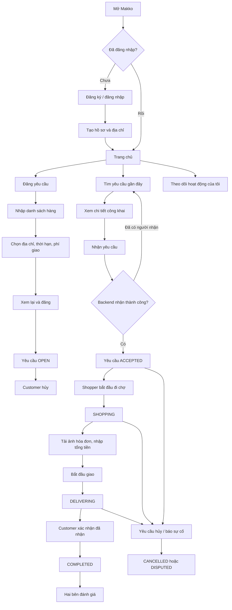
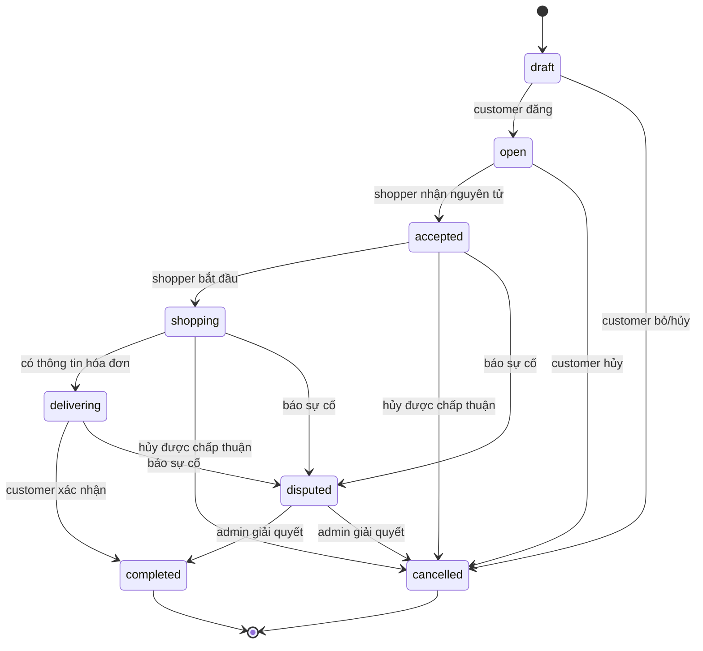

# Makko — User flow MVP

## 1. Phạm vi và nguyên tắc

- Một tài khoản có thể vừa là **người đăng yêu cầu** (customer), vừa là **người đi chợ** (shopper).
- MVP hỗ trợ một shopper cho mỗi yêu cầu; không chia một yêu cầu cho nhiều người.
- Địa chỉ chính xác và chat chỉ hiển thị cho chủ yêu cầu và shopper đã nhận.
- Giá hàng thực tế được xác nhận qua hóa đơn. Thanh toán trực tuyến chưa nằm trong luồng MVP đầu tiên.
- Mọi chuyển trạng thái quan trọng phải được kiểm tra ở backend, không tin trạng thái gửi từ client.

## 2. Sơ đồ tổng thể

## 3. Luồng chi tiết theo vai trò

### 3.1 Đăng ký và onboarding

1. Người dùng đăng ký bằng email/điện thoại và xác thực tài khoản.
2. Nhập tên hiển thị, ảnh đại diện và số điện thoại liên hệ.
3. Thêm ít nhất một địa chỉ giao hàng; chọn vị trí trên bản đồ.
4. Đồng ý điều khoản cộng đồng và chính sách hàng hóa bị cấm.
5. Vào trang chủ. Người dùng có thể bỏ qua bước đăng ký làm shopper cho đến khi nhận đơn đầu tiên.

Trạng thái lỗi cần thiết: mã xác thực sai/hết hạn, địa chỉ ngoài vùng phục vụ, tài khoản bị khóa.

### 3.2 Customer đăng yêu cầu

1. Chọn **Tạo yêu cầu**.
2. Thêm từng mặt hàng: tên, số lượng, đơn vị, ngân sách dự kiến và ghi chú/thương hiệu thay thế.
3. Thêm ảnh minh họa nếu cần.
4. Chọn địa chỉ giao, thời hạn giao và phí giao đề xuất.
5. Xem lại tổng ngân sách dự kiến và quy tắc thay thế hàng.
6. Lưu nháp hoặc đăng yêu cầu.
7. Khi đăng thành công, yêu cầu chuyển `draft -> open` và xuất hiện trong danh sách phù hợp.

Quy tắc: tối thiểu một mặt hàng; phí/giá không âm; thời hạn phải ở tương lai; snapshot địa chỉ được lưu trên yêu cầu để lịch sử không đổi khi người dùng sửa sổ địa chỉ.

### 3.3 Shopper tìm và nhận yêu cầu

1. Cho phép truy cập vị trí hoặc chọn khu vực thủ công.
2. Xem danh sách yêu cầu `open`, lọc theo khoảng cách, thời hạn và phí giao.
3. Xem thông tin công khai: khu vực gần đúng, danh sách hàng, thời hạn, phí và đánh giá customer.
4. Chọn **Nhận yêu cầu** và xác nhận.
5. Backend chỉ nhận khi yêu cầu vẫn là `open`; thao tác là nguyên tử để hai shopper không thể cùng nhận.
6. Khi thành công, hai bên thấy thông tin liên hệ, địa chỉ đầy đủ và phòng chat của yêu cầu.

### 3.4 Thực hiện và giao hàng

1. Shopper chọn **Bắt đầu đi chợ**: `accepted -> shopping`.
2. Shopper trao đổi thay thế mặt hàng qua chat; customer chấp thuận thay đổi quan trọng.
3. Shopper tải ảnh hóa đơn, nhập tổng tiền và ghi chú chênh lệch.
4. Shopper chọn **Bắt đầu giao**: `shopping -> delivering`.
5. Customer nhận hàng và chọn **Đã nhận hàng**: `delivering -> completed`.
6. Nếu customer không phản hồi, MVP chưa tự động hoàn tất; admin xử lý thủ công.

### 3.5 Hủy và tranh chấp

- Customer được hủy trực tiếp khi `open`.
- Sau khi đã có shopper, một bên gửi yêu cầu hủy kèm lý do; backend quyết định `cancelled` theo quy tắc vận hành.
- Khi đã mua hàng hoặc đang giao, vấn đề về tiền/hàng chuyển sang `disputed`, không xóa dữ liệu hay hóa đơn.
- Mọi thay đổi trạng thái được ghi vào lịch sử với người thực hiện và lý do.

### 3.6 Đánh giá

1. Chỉ thành viên của yêu cầu `completed` mới được đánh giá người còn lại.
2. Mỗi người chỉ tạo một đánh giá cho đối phương trên mỗi yêu cầu.
3. Điểm từ 1–5; nội dung nhận xét là tùy chọn.

## 4. State machine

## 5. Danh sách màn hình MVP

| Nhóm | Màn hình |
|---|---|
| Auth | Đăng nhập, đăng ký, xác thực, quên mật khẩu |
| Onboarding | Hồ sơ, quyền vị trí, sổ địa chỉ |
| Khám phá | Trang chủ, danh sách/bản đồ yêu cầu, bộ lọc, chi tiết yêu cầu |
| Customer | Tạo/sửa nháp, xem lại, theo dõi yêu cầu, xác nhận giao hàng |
| Shopper | Xác nhận nhận đơn, đơn đang thực hiện, hóa đơn, cập nhật trạng thái |
| Chung | Chat, thông báo, lịch sử, đánh giá, báo sự cố, hồ sơ |

## 6. Tiêu chí hoàn thành luồng lõi

- Hai shopper nhận cùng lúc: đúng một người thành công.
- Người ngoài yêu cầu không đọc được địa chỉ đầy đủ, chat, hóa đơn hoặc dữ liệu tranh chấp.
- Không thể bỏ qua hoặc quay ngược trạng thái trái phép.
- Lịch sử trạng thái không sửa/xóa từ client.
- Customer và shopper đều nhìn thấy trạng thái mới sau khi cập nhật.
- Một yêu cầu hoàn thành tạo được tối đa hai đánh giá, mỗi hướng một đánh giá.

